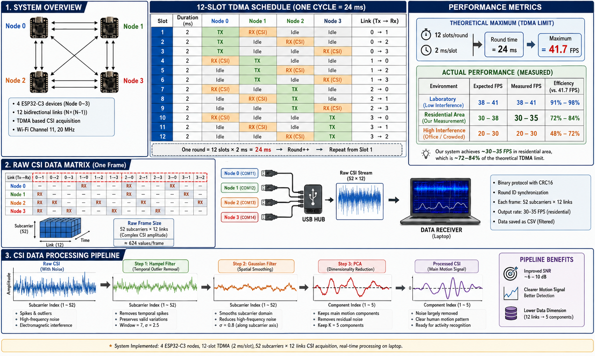

# TDMA-Based Multi-Link CSI Acquisition System  
### Virtual MIMO Architecture with 4× ESP32-C3 SISO Nodes

---

## System Architecture



*Figure 1. Complete system overview showing (1) the 4-node Virtual MIMO topology with 12-slot TDMA schedule, (2) raw CSI data matrix structure and USB data pipeline, and (3) the three-stage signal processing pipeline (Hampel → Gaussian → PCA).*

---

## Table of Contents

- [1. Introduction](#1-introduction)
- [2. Hardware Platform: ESP32-C3](#2-hardware-platform-esp32-c3)
- [3. System Architecture](#3-system-architecture-1)
- [4. Signal Processing Pipeline](#4-signal-processing-pipeline)
- [5. Experimental Results](#5-experimental-results)
- [6. Limitations and Future Work](#6-limitations-and-future-work)

---

## 1. Introduction

Channel State Information (CSI) extracted from commercial WiFi transceivers has emerged as a promising modality for device-free sensing, enabling applications such as Human Activity Recognition (HAR), gesture detection, and pose estimation without requiring users to carry dedicated sensors. However, CSI obtained from a single-link Single-Input Single-Output (SISO) transceiver provides limited spatial diversity, constraining the discriminative power of downstream machine learning models.

This work presents the design and implementation of a low-cost, multi-link CSI acquisition platform based on a **Virtual MIMO** architecture, employing **TDMA-based Multi-Link CSI Acquisition**. The system exploits *N* = 4 SISO transceiver nodes operating under a Time-Division Multiple Access (TDMA) schedule to produce *N*(*N*−1) = 12 independent wireless links per measurement cycle. Each link captures a distinct spatial perspective of the monitored environment, collectively providing channel diversity equivalent to a distributed antenna array — realized entirely through time-multiplexing of inexpensive single-antenna hardware.

---

## 2. Hardware Platform: ESP32-C3

### 2.1. Device Specifications

The ESP32-C3, manufactured by Espressif Systems, is a single-core RISC-V 32-bit microcontroller integrating an IEEE 802.11 b/g/n transceiver operating in the 2.4 GHz ISM band with 20 MHz channel bandwidth (HT20). It supports physical-layer CSI extraction from the Long Training Field (LTF) via the ESP-IDF SDK and features a built-in USB Serial JTAG interface capable of sustaining data rates up to 2,000,000 baud without external UART-USB bridge circuitry.

### 2.2. Rationale for Selection

The ESP32-C3 was chosen based on the following criteria:

| Criterion | Detail |
|:---|:---|
| Cost | Low unit cost enabling multi-node deployment |
| Form factor | Compact size suitable for unobtrusive installation |
| Communication | Native ESP-NOW peer-to-peer protocol with sub-millisecond latency |
| CSI access | Firmware-level access to raw CSI buffers (amplitude + phase) |

### 2.3. Limitations and Architectural Consequences

Despite its advantages, the ESP32-C3 exhibits several constraints that directly shaped the system architecture:

| Limitation | Impact | Design Decision |
|:---|:---|:---|
| **SISO-only** radio chain | No native spatial multiplexing | → Multi-node Virtual MIMO topology |
| **Single-core** CPU, no DSP | Cannot process multi-link CSI in real-time | → Offload all filtering/PCA to host PC |
| **`first_word_invalid`** errata | First 4 bytes of CSI buffer may be corrupted | → Firmware-level deterministic zeroing |

---

## 3. System Architecture

### 3.1. Hardware Topology

The system comprises four ESP32-C3 nodes connected to a host PC through a USB Hub. All nodes operate on **WiFi Channel 11** (2.462 GHz) in Station mode. Inter-node communication uses **ESP-NOW** at HT20 / MCS0 (BPSK, coding rate 1/2), chosen for robustness against channel fading. Maximum transmit power is configured at **13 dBm**.

### 3.2. TDMA Schedule Design

**Node 0** serves as the TDMA Master, maintaining the global cycle counter (`round_id`) and providing timing reference. Nodes 1–3 operate as Slaves. Each TDMA cycle comprises **12 time slots**, one for each ordered transmitter–receiver pair in the full-mesh topology.

**TDMA Timing Budget:**

| Parameter | Symbol | Value |
|:---|:---:|---:|
| Number of nodes | *N* | 4 |
| Slots per cycle | *N*_slot | 12 |
| Slot duration | *T*_slot | 2,000 µs |
| Cycle period | *T*_cycle | 24,000 µs (24 ms) |
| Theoretical max frame rate | *f*_max | **41.67 fps** |
| ACK timeout per attempt | *T*_ack | 500 µs |
| Maximum retries | *R* | 1 |
| Worst-case active time | *T*_active | 1,000 µs |
| Guard time | *T*_guard | 1,000 µs |

**Slot-level protocol:** Within each slot, the designated transmitter sends a Probe packet via ESP-NOW. Upon reception, the receiver: (a) extracts CSI from the physical-layer preamble and enqueues it with the current `round_id` captured atomically inside the ISR callback, and (b) returns an ACK packet. If no ACK is received within 500 µs, a single retry is attempted. The remaining 1,000 µs guard time accommodates CRC16 computation and USB Serial JTAG write operations.

### 3.3. Inter-Node Synchronization (Hard Sync)

Clock drift between independent crystal oscillators is suppressed by a **Hard Sync** mechanism. When a Slave node receives the Master's first Probe of a new `round_id`, it:

1. Enters a critical section (`portDISABLE_INTERRUPTS()`),
2. Resets its local slot counter to the expected position based on its node ID,
3. Exits the critical section and restarts the hardware timer.

This re-synchronization occurs **once per cycle (every 24 ms)**, preventing drift accumulation.

### 3.4. Binary Transmission Protocol

| Field | Size | Description |
|:---|:---:|:---|
| Magic word | 4 B | `0x43534921` ("CSI!" little-endian) |
| `round_id` | 4 B | TDMA cycle identifier |
| `tx_id` | 1 B | Transmitter node index (0–3) |
| `rx_id` | 1 B | Receiver node index (0–3) |
| RSSI | 1 B | Received signal strength (dBm, signed) |
| `csi_len` | 2 B | CSI payload length |
| CSI payload | *csi_len* B | Raw I/Q samples (int8 pairs) |
| CRC16-CCITT | 2 B | Integrity checksum |

On the host side, **four concurrent reader threads** (one per COM port) perform buffered binary parsing with magic word resynchronization. Records failing CRC16 verification are silently discarded. A **garbage collector** purges incomplete rounds when the current `round_id` exceeds theirs by more than 10 units, preventing memory leaks during long-duration operation.

### 3.5. Subcarrier Selection

Each raw CSI vector contains **64 subcarriers** (LLTF, HT20). The following are removed:

- **Subcarrier 0** — DC component (carrier frequency offset corruption)
- **Subcarriers 27–37** — Guard band (no channel information)

The remaining **52 clean subcarriers** yield a per-frame CSI amplitude matrix of dimension **52 × 12**.

---

## 4. Signal Processing Pipeline

```
Raw CSI (52×12) → Hampel Filter → Gaussian Filter → Online PCA → Output (52×5)
                   (temporal)      (subcarrier)       (link)
```

The ordering is deliberate: **Hampel before Gaussian** prevents spike energy from spreading through the convolution kernel; **Gaussian before PCA** ensures the covariance matrix is not distorted by inter-subcarrier noise.

### 4.1. Stage 1 — Hampel Filter (Temporal Domain)

Operates independently on each of the 52 × 12 = 624 CSI amplitude time series to detect and replace impulsive outliers.

For a time series *x*(*t*) with sliding window *W_t* of size *W* = 2*m* + 1 centered at *t*:

```
x̃(t) = median(W_t)

MAD(t) = median({ |x(i) − x̃(t)| }  for i = t−m ... t+m)

σ̂(t) = 1.4826 × MAD(t)
```

A sample is classified as an **outlier** and replaced by the median if:

```
|x(t) − x̃(t)| > n_σ × σ̂(t)   AND   MAD(t) > ε
```

| Parameter | Value | Description |
|:---|:---:|:---|
| Window size (*W*) | 7 frames | Sliding window width |
| Threshold (*n*_σ) | 2.5 | Sigma multiplier |
| Floor (ε) | 10⁻⁹ | Prevents false detection on flat signals |
| Latency | 3 frames | ⌊*W*/2⌋ frames delay |

### 4.2. Stage 2 — Gaussian Filter (Subcarrier Domain)

A 1D Gaussian convolution along the subcarrier axis of each frame, targeting EMI sawtooth noise between adjacent subcarriers.

```
G(u) = (1 / √(2π)·σ_g) · exp(−u² / (2·σ_g²))
```

| Parameter | Value | Description |
|:---|:---:|:---|
| Sigma (σ_g) | 0.8 | Kernel standard deviation |
| Kernel size (*K*) | 7 | 2·⌈3·σ_g⌉ + 1 |
| Boundary | Reflect | Mirror padding at edges |

### 4.3. Stage 3 — Online Spatial PCA with Temporal Detrending

Reduces link dimension from *L* = 12 to *k* = 5 principal components, capturing dominant motion-related variance.

**Step 1 — DC elimination (Temporal detrending):**

```
M_t = (1 − α)·M_{t−1} + α·X_t       (α = 0.05, τ = 20 frames)
Z_t = X_t − M_t                        (AC component)
```

**Step 2 — Recursive spatial covariance estimation:**

```
C_inst,t = (1/(S−1))·Z_t^T·Z_t
C_t = (1 − β)·C_{t−1} + β·C_inst,t    (β = 0.05, τ = 20 frames)
```

**Step 3 — Eigendecomposition + Sign Alignment:**

The top-*k* eigenvectors of *C_t* form projection matrix **P_t** ∈ ℝ^(12×5). To prevent random sign flips:

```
v_j^(t) ← sign(⟨v_j^(t), v_j^(t−1)⟩) · v_j^(t)
```

with dead-zone |dot| < 0.1 to avoid erroneous flips near eigenvalue crossings.

**Step 4 — Projection:**

```
X_{t,pca} = Z_t · P_t ∈ ℝ^(52×5)
```

A **warm-up phase of 5 frames** ensures the running mean is initialized from averaged data.

### 4.4. Pipeline Summary

| Stage | Domain | Dimension | Purpose | Key Parameters |
|:---|:---|:---:|:---|:---|
| Hampel | Temporal | 52×12 → 52×12 | Impulsive spike removal | *W*=7, *n*_σ=2.5 |
| Gaussian | Subcarrier | 52×12 → 52×12 | EMI smoothing | σ_g=0.8, *K*=7 |
| PCA | Link | 52×12 → 52×5 | Dimensionality reduction | *k*=5, α=0.05, β=0.05 |

---

## 5. Experimental Results

### 5.1. Measurement Conditions

Two measurement campaigns were conducted under different configurations:

| | Run A | Run B |
|:---|:---|:---|
| **TDMA config** | Previous configuration (conservative timing) | Current configuration (*T*_slot = 2,000 µs) |
| **Environment** | Indoor laboratory | University library (ambient WiFi interference) |
| **Duration** | 105.3 s (sustained) | 7.2 s (pilot measurement) |
| **Purpose** | Stability assessment over extended session | Functional verification of current design |

### 5.2. Quantitative Results

| Metric | Run A | Run B |
|:---|---:|---:|
| Duration | 105.3 s | 7.2 s |
| Total frames assembled | 1,959 | 880 |
| Complete frames (12/12 links) | 1,387 | 286 |
| Incomplete frames | 572 | 594 |
| CRC errors | 4 | 4 |
| **Frame completeness ratio** | **70.8%** | **32.5%** |
| Total frame rate | 18.61 fps | 121.47 fps |
| **Complete frame rate** | **13.17 fps** | **39.48 fps** |
| Exported CSV frames | 1,387 | 286 |

### 5.3. Analysis

**Run A (previous configuration, 105.3 s)** achieved a frame completeness ratio of **70.8%**, indicating that approximately 7 out of every 10 TDMA cycles captured all 12 links. The total frame rate of 18.61 fps — substantially below the current configuration's theoretical maximum of 41.67 fps — reflects the use of a more conservative TDMA timing schedule with longer slot durations providing greater guard margins. The complete frame rate of 13.17 fps yielded **1,387 exportable frames**, demonstrating that the system operates stably over multi-minute sessions without memory leaks or synchronization loss.

**Run B (current configuration, university library, 7.2 s pilot)** achieved a complete frame rate of **39.48 fps**, corresponding to **94.7% of the theoretical maximum** (41.67 fps). This confirms that the 2,000 µs slot design is near-optimal in terms of throughput. However, the low completeness ratio (32.5%) indicates that the majority of cycles suffered at least one link failure, attributable to the dense WiFi environment of the university library (multiple co-channel access points, student devices). The elevated total frame rate of 121.47 fps (exceeding the single-cycle maximum) is an artifact of incomplete rounds being counted individually rather than occupying a full cycle period. This was a short-duration pilot measurement; extended campaigns under the current configuration are planned.

**CRC integrity:** Both runs recorded only **4 CRC errors** (< 0.3% of total frames), confirming effective data integrity over USB.

### 5.4. TDMA Parameter Sensitivity Analysis

The contrast between Run A and Run B illustrates the fundamental trade-off between **frame rate** and **link reliability** in the TDMA design.

#### 5.4.1. Slot Duration (*T*_slot)

The maximum frame rate is inversely proportional to slot duration:

> *f*_max = 1 / (*N*_slot × *T*_slot)

| *T*_slot | *T*_cycle | *f*_max | *T*_guard | Trade-off |
|---:|---:|---:|---:|:---|
| 1,000 µs | 12 ms | 83.3 fps | 0 µs | ⚠️ No guard; high overflow risk |
| 1,500 µs | 18 ms | 55.6 fps | 500 µs | ⚠️ Marginal guard for USB I/O |
| **2,000 µs** | **24 ms** | **41.7 fps** | **1,000 µs** | ✅ **Current — balanced** |
| 3,500 µs | 42 ms | 23.8 fps | 2,500 µs | Conservative; higher completeness |
| 5,000 µs | 60 ms | 16.7 fps | 4,000 µs | Very conservative; diminishing returns |

The higher completeness of Run A (70.8%) versus Run B (32.5%) is consistent with a longer slot duration providing more margin for processing and retransmission.

#### 5.4.2. ACK Timeout (*T*_ack)

| *T*_ack | Retries | *T*_active | *T*_guard | Impact |
|---:|:---:|---:|---:|:---|
| 300 µs | 1 | 600 µs | 1,400 µs | ⚠️ Premature timeout risk (ESP-NOW RTT: 200–400 µs) |
| **500 µs** | **1** | **1,000 µs** | **1,000 µs** | ✅ **Current** |
| 750 µs | 1 | 1,500 µs | 500 µs | Higher ACK rate; compressed guard |
| 500 µs | 2 | 1,500 µs | 500 µs | Additional retry; same guard reduction |

#### 5.4.3. Retry Count (*R*)

| Retries | *T*_active | *T*_guard | Note |
|:---:|---:|---:|:---|
| 0 | 500 µs | 1,500 µs | Baseline; single attempt |
| **1** | **1,000 µs** | **1,000 µs** | ✅ **Current** |
| 2 | 1,500 µs | 500 µs | Diminishing returns |
| 3 | 2,000 µs | 0 µs | ⚠️ Entire slot consumed |

The measured 32.5% completeness in the library environment suggests that **RF-level interference** — not insufficient retries — is the dominant loss mechanism. Environmental mitigations (channel selection, antenna placement, power tuning) are likely more effective.

#### 5.4.4. Network Scaling

| Nodes (*N*) | Links | *T*_cycle | *f*_max |
|:---:|:---:|---:|---:|
| 3 | 6 | 12 ms | 83.3 fps |
| **4** | **12** | **24 ms** | **41.7 fps** |
| 5 | 20 | 40 ms | 25.0 fps |
| 6 | 30 | 60 ms | 16.7 fps |

The frame rate degrades as *f*_max ∝ 1/*N*², representing a fundamental scalability constraint of the full-mesh topology.

---

## 6. Limitations and Future Work

The following items have **not** been systematically evaluated under controlled conditions:

- [ ] Extended measurement campaigns (> 10 min) under the current TDMA configuration
- [ ] Quantitative SNR improvement per filter stage (Hampel, Gaussian, PCA)
- [ ] Optimal PCA component count (*k*) across different activity types
- [ ] End-to-end latency: CSI extraction → processed 52×5 matrix availability
- [ ] Downstream AI model accuracy (HAR, Pose Estimation) on processed features
- [ ] Completeness comparison across WiFi channels, power levels, and node geometries

---

## Project Structure

```
csi_sync_project/
├── main/
│   └── main.c                  # ESP32-C3 firmware (TDMA + CSI + binary protocol)
├── python/
│   ├── csi_receiver.py         # Multi-threaded binary CSI receiver
│   ├── csi_processor.py        # Hampel + Gaussian + PCA pipeline + real-time plot
│   ├── analyze_pca.py          # PCA analysis utilities
│   └── verify_pca_fix.py       # PCA sign alignment verification
├── docs/
│   └── system_architecture.png # System overview diagram (Figure 1)
├── readme/
│   ├── CSI.md                  # Detailed synchronization mechanism documentation
│   └── noise_filter_report.md  # Mathematical derivations of filter algorithms
├── csi_data/                   # Collected CSI datasets (CSV)
├── CMakeLists.txt              # ESP-IDF build configuration
├── sdkconfig                   # ESP-IDF SDK configuration
└── README.md                   # This file
```

---

## Quick Start

```bash
# 1. Flash firmware to all 4 ESP32-C3 nodes
idf.py build flash monitor

# 2. Run CSI receiver only (raw data collection)
cd python
python csi_receiver.py

# 3. Run full pipeline (receiver + filter + real-time plot)
cd python
python csi_processor.py
```

---

## License

This project is developed for academic research purposes.
